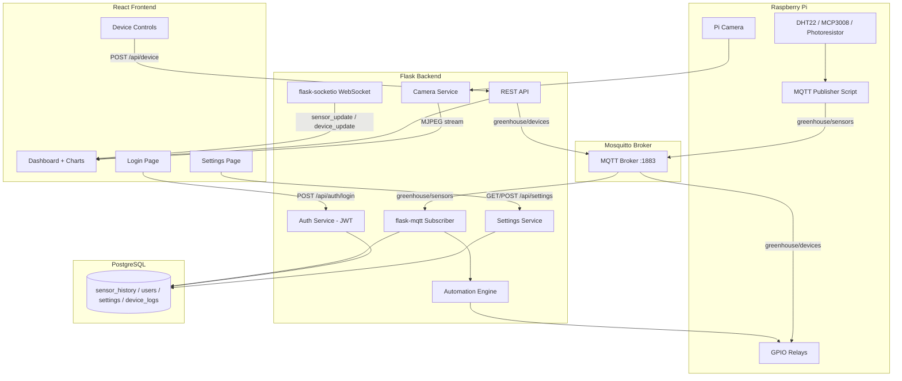

# Design Document: Greenhouse Full-Stack Completion

## Overview

SmartFarmXBot is an IoT greenhouse control system running on Raspberry Pi 4 with a Flask backend and React + Vite frontend. The current system has a working skeleton with mock/real sensor reading, GPIO device control, and a dashboard UI, but lacks production-critical infrastructure: real-time MQTT communication from sensors, persistent PostgreSQL storage, JWT authentication, server-side automation, and camera streaming.

This design introduces MQTT (Mosquitto) as the transport layer between Raspberry Pi sensors and the Flask backend, PostgreSQL for persistent storage (replacing JSON file and in-memory stores), flask-socketio for real-time frontend updates, JWT authentication via PyJWT, a unified backend automation engine, and Pi Camera MJPEG streaming. The architecture ensures a single source of truth for device control decisions on the backend, eliminating the current duplicate frontend automation logic.

## Architecture

